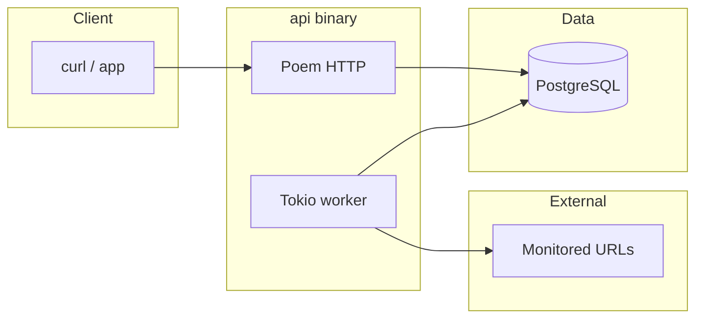

# better-uptime

A small **website uptime monitor**: users sign up, add URLs, and the service records HTTP checks on a schedule plus on-demand checks. Built as a Rust workspace (HTTP API + PostgreSQL + background worker).

**Stack:** Rust (edition 2024), [Poem](https://github.com/poem-web/poem), Tokio, Diesel + PostgreSQL, [deadpool-diesel](https://github.com/bikeshedder/deadpool), JWT (HS256) + Argon2, Docker Compose.

## Features

- Sign up / sign in with Argon2 password hashes and JWT-protected routes
- CRUD for monitored websites (per-user)
- Background worker: periodic HTTP checks, writes history and latest status
- On-demand check, status snapshot, paginated check history
- **Migrations** run automatically when the API process starts (embedded Diesel migrations from `store/migrations`)

## Architecture



## Prerequisites

- **Rust** (stable; see `rust-toolchain.toml`)
- **PostgreSQL 16** (local or Docker)
- **OpenSSL** toolchain optional — used only to generate `JWT_SECRET`

## Quick start (local)

1. Copy environment template and set a real JWT secret (≥ 32 characters):

   ```bash
   cp .env.example .env
   # Edit .env — at minimum set JWT_SECRET, e.g.:
   # openssl rand -base64 32
   ```

2. Start Postgres (or use an existing instance and set `DATABASE_URL` in `.env`).

   ```bash
   docker compose up -d postgres
   ```

3. Run the API (migrations apply on startup, then the server listens on `0.0.0.0:3000`):

   ```bash
   cargo run -p api
   ```

## Quick start (full stack in Docker)

1. `cp .env.example .env` and set **`JWT_SECRET`** (required — `docker compose` will fail without it).

2. Start API + Postgres:

   ```bash
   docker compose up --build
   ```

The API container receives a `DATABASE_URL` pointing at the `postgres` service. Your `.env` must define `JWT_SECRET` for variable substitution in `docker-compose.yml`.

## Environment variables

| Variable | Required | Description |
|----------|----------|-------------|
| `DATABASE_URL` | Yes | PostgreSQL connection URL (see `.env.example`) |
| `JWT_SECRET` | Yes | HMAC key for JWT; **minimum 32 characters** |
| `POSTGRES_*` | Optional | Used by `docker-compose.yml` for the database service defaults |

## HTTP API (overview)

Base URL: `http://localhost:3000` (or your host).

Public:

- `POST /sign-up` — JSON `{ "username", "password" }`
- `POST /sign-in` — same body; returns `{ "jwt": "<token>" }`

Protected (header `Authorization: Bearer <jwt>`):

- `GET/POST/PUT/DELETE` — `/websites`, `/website`, `/website/:id`, etc.
- `GET /website/:id/check` — run a check now
- `GET /website/:id/status` — last known status
- `GET /website/:id/history?limit=&offset=` — check history

### Example: sign up, sign in, create a website

```bash
curl -sS -X POST http://localhost:3000/sign-up \
  -H 'Content-Type: application/json' \
  -d '{"username":"alice","password":"hunter42now"}'

curl -sS -X POST http://localhost:3000/sign-in \
  -H 'Content-Type: application/json' \
  -d '{"username":"alice","password":"hunter42now"}'
# Copy the jwt value, then:

export JWT='<paste jwt here>'

curl -sS -X POST http://localhost:3000/website \
  -H "Authorization: Bearer $JWT" \
  -H 'Content-Type: application/json' \
  -d '{"url":"https://example.com"}'
```

## Project layout

| Path | Role |
|------|------|
| `api/` | HTTP server, worker, JWT, startup config & embedded migrations |
| `store/` | Diesel models, schema, SQL migrations |
| `docker-compose.yml` | Postgres + API services |
| `Dockerfile` | Multi-stage release image for `api` |

## Development

```bash
cargo fmt --all
cargo clippy --workspace --all-targets -- -D warnings
cargo build --workspace
cargo test --workspace
```

CI (GitHub Actions) runs the same checks on push/PR to `main`.

## License

MIT — see [LICENSE](LICENSE).
